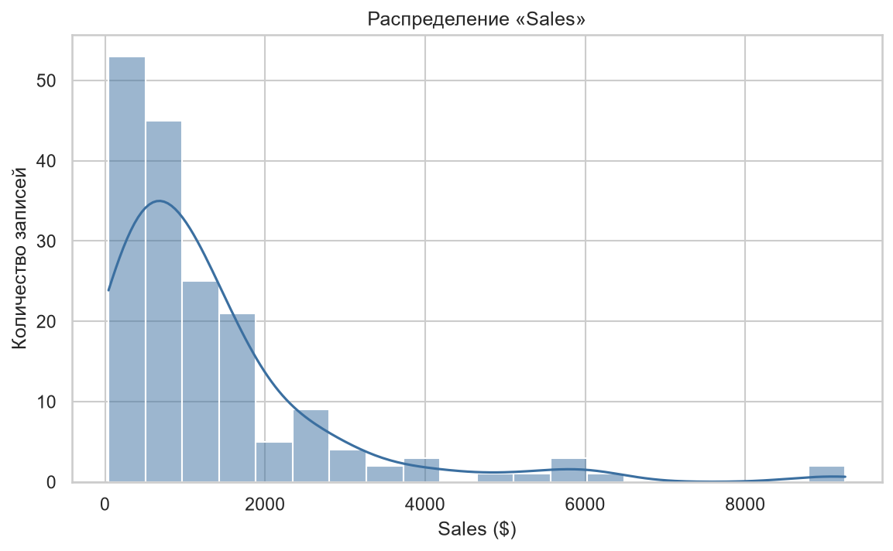
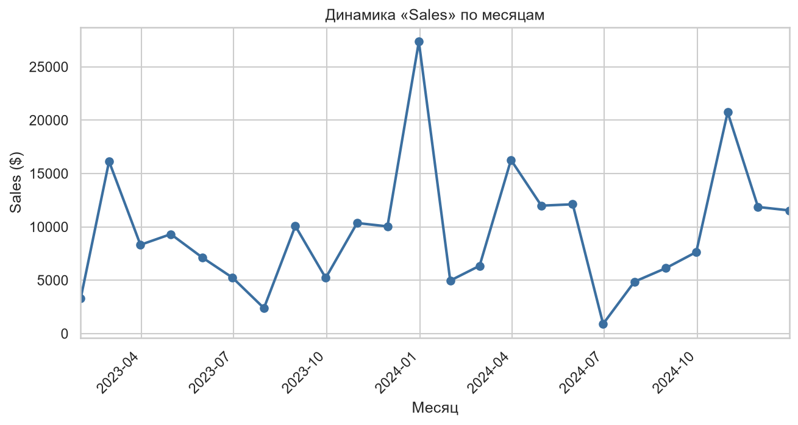
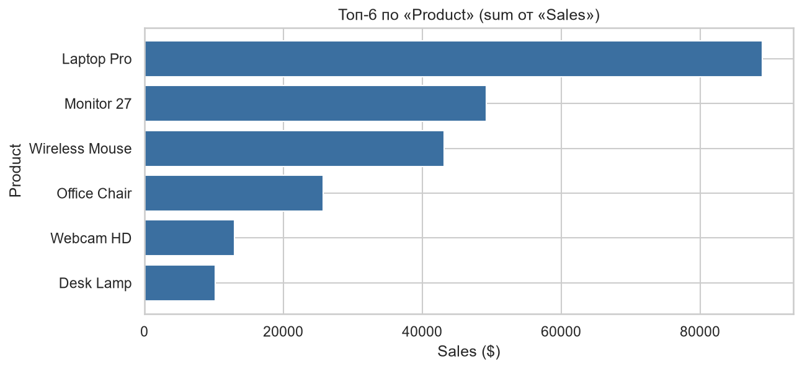
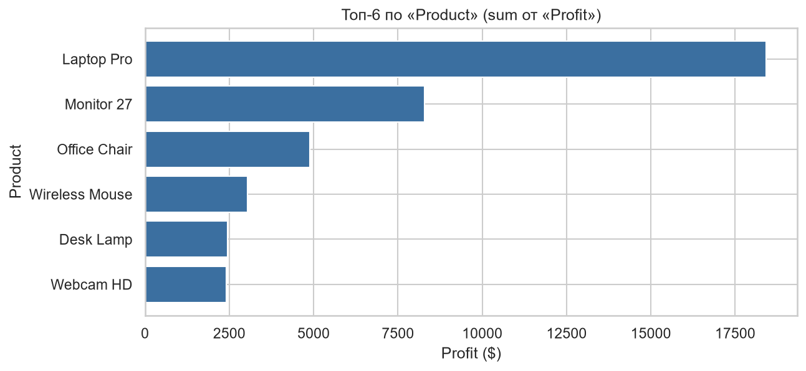
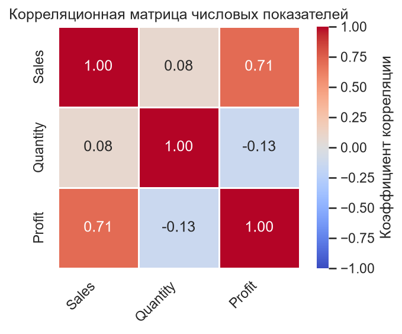
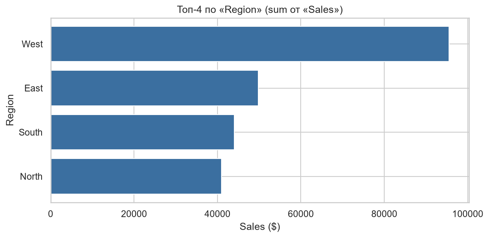
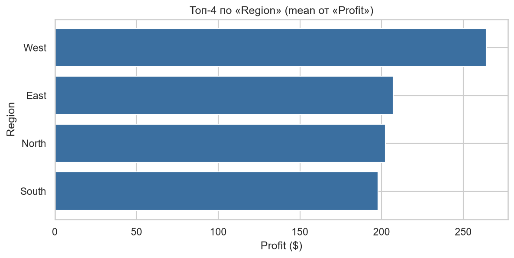

# Отчёт по анализу продаж (2023–2024)

> Демонстрационный отчёт. Текст целиком написан LLM (Claude Desktop) по
> результатам диалога с MCP-сервером `sales-analytics`: модель сама
> выбирала инструменты, строила графики и формулировала выводы. Код
> отчёт не генерирует — `prepare_insights_context` только собирает
> факты, `export_report` сохраняет готовый текст (архитектурный
> инвариант №6, см. CLAUDE.md и ARCHITECTURE.md).
>
> В этот файл добавлены только ссылки на графики — сам текст
> не редактировался.
>
> **Замечание к разделу 6.** Отчёт подаёт корреляцию Quantity ↔ Profit
> (−0,13) увереннее, чем позволяет выборка в 175 строк: такой
> коэффициент статистически неотличим от нуля. Вывод при этом верный,
> но опирается он не на корреляцию, а на разрыв долей из раздела 5
> (Wireless Mouse: 19% оборота против 8% прибыли). Причина —
> `correlation_analysis` на момент прогона возвращал голые
> коэффициенты; после прогона инструмент доработан и теперь сообщает
> объём выборки и характеристику силы связи, помечая такие пары как
> неотличимые от нуля. Текст отчёта оставлен как есть — он документирует
> реальный прогон, а не отредактированный задним числом идеал.

## 1. Исходные данные

Файл: `sales_data.csv`, 180 строк × 6 колонок, период 05.01.2023 – 25.12.2024.
Колонки: Date, Product, Region, Sales, Quantity, Profit.

## 2. Качество данных — главная проблема

При загрузке обнаружено, что дефекты есть примерно в каждой десятой строке:

| Дефект | Объём | Что сделано |
|---|---|---|
| Разнобой в написании регионов | 27 значений, 15 «уникальных» регионов вместо 4 | нормализация → осталось 4: West, East, North, South |
| Полные дубли строк | 5 | удалены |
| Пропуски в Sales | 12 | заполнены медианой |
| Пропуски в Profit | 12 | заполнены медианой |
| Выбросы (1.5×IQR) | Sales — 11, Quantity — 26, Profit — 15; всего 43 строки (25%) | помечены флагом `is_outlier`, не удалены |

После очистки: 175 строк.

**Вывод:** «West», «west», « West» в одной колонке — это не ошибка аналитика, это отсутствие валидации на вводе. Пока это не починено, любая отчётность по регионам врёт: до очистки West терял часть своих продаж в пользу фантомных категорий.

## 3. Ключевые показатели после очистки

- Выручка (сумма Sales): ≈ 230 300
- Прибыль (сумма Profit): ≈ 39 500
- Общая маржа: **17,1%**
- Средний чек: 1316, медиана 905 (распределение сильно скошено вправо — много мелких сделок и небольшое число крупных)
- Средняя прибыль со сделки: 226, медиана 138

## 4. Динамика и сезонность

- 2023: 114 891 → 2024: 115 381. Рост **+0,4%** — это стагнация, а с поправкой на инфляцию — падение.
- Пик: декабрь 2023 (27 361). Минимум: июнь 2024 (905).
- Устойчивая сезонность: самый сильный месяц — декабрь, самый слабый — июнь. Разброс между пиком и провалом — в десятки раз.

## 5. Продукты

| Продукт | Выручка | Доля | Прибыль | Маржа |
|---|---|---|---|---|
| Laptop Pro | 88 972 | 39% | 18 417 | 20,7% |
| Monitor 27 | 49 254 | 21% | 8 283 | 16,8% |
| Wireless Mouse | 43 122 | 19% | 3 043 | **7,1%** |
| Office Chair | 25 747 | 11% | 4 886 | 19,0% |
| Webcam HD | 12 990 | 6% | 2 413 | 18,6% |
| Desk Lamp | 10 187 | 4% | 2 442 | 24,0% |

Два вывода:
1. **Концентрация.** Laptop Pro даёт 39% выручки и 47% всей прибыли. Один товар держит половину бизнеса — это риск.
2. **Wireless Mouse — дыра в марже.** 19% выручки, но всего 8% прибыли при марже 7,1%. Самый маржинальный товар, наоборот, самый мелкий по обороту — Desk Lamp (24%).

## 6. Корреляции

- Sales ↔ Profit: **+0,71** — ожидаемо и нормально.
- Quantity ↔ Profit: **−0,13** — больше штук в сделке, меньше прибыли.
- Sales ↔ Quantity: **+0,08** — количество почти не влияет на сумму сделки.

Это подтверждает картину по продуктам: объёмные сделки — это дешёвая периферия (Quantity доходит до 153 штук), которая не зарабатывает. Объём не конвертируется в деньги.

## 7. Регионы

| Регион | Выручка | Доля | Средняя прибыль со сделки |
|---|---|---|---|
| West | 95 520 | 41% | 264 |
| East | 49 828 | 22% | 207 |
| South | 43 997 | 19% | 198 |
| North | 40 928 | 18% | 202 |

West лидирует и по объёму, и по качеству сделок — это не просто «больше клиентов», там выше средний чек и прибыль на сделку. Остальные три региона практически неразличимы между собой.

## 8. Практические рекомендации

**Приоритет 1 — починить ввод данных.** Справочник регионов вместо свободного текста, обязательные поля Sales и Profit, защита от повторной отправки формы. Без этого следующая выгрузка снова придёт с 15 регионами, а 12 пропусков в деньгах — это уже потерянная выручка в отчётности, а не техническая мелочь.

**Приоритет 2 — разобраться с Wireless Mouse.** Маржа 7% при 19% оборота. Три гипотезы, которые нужно проверить по документам: закупочная цена выросла, а розничная нет; скидки при больших количествах не ограничены сверху; логистика мелкогабарита не заложена в цену. Либо поднять цену, либо ввести потолок скидки по количеству, либо сознательно оставить как трафикообразующий товар — но тогда считать его в маркетинг, а не в продажи.

**Приоритет 3 — снизить зависимость от Laptop Pro.** Половина прибыли на одном SKU. Точка роста — Desk Lamp: лучшая маржа (24%) при минимальном обороте. Проверить, почему он не продаётся: дистрибуция, выкладка, отсутствие в связках. Продвигать связки «ноутбук + лампа + мышь» с фиксированной маржой набора.

**Приоритет 4 — работать с сезонностью, а не терпеть её.** Декабрь обеспечивает пик — под него нужно планировать закуп и рекламный бюджет заранее, с сентября. Летний провал (июнь) — либо закрывать акциями и B2B-контрактами на оснащение офисов, либо резать переменные расходы на этот период. Сейчас похоже, что провал просто принимают как данность.

**Приоритет 5 — тиражировать практику West.** Разница в средней прибыли West (264) и South (198) — 33%. Стоит выяснить, что именно там иначе: продуктовый микс, размер клиентов, дисциплина по скидкам. Это самый дешёвый источник роста — переносить работающее, а не изобретать.

## 9. Ограничения анализа

- 175 строк за два года — это выборка, а не полная база продаж. Абсолютные суммы, скорее всего, не равны реальному обороту компании; относительные пропорции надёжнее абсолютных.
- 24 значения (Sales и Profit) заполнены медианой. Выводы по средним слегка смещены к центру, реальный разброс шире.
- 43 строки (25%) помечены как выбросы, но не удалены. Крупные сделки — часть реального бизнеса, а не шум, но перед принятием решений их стоит проверить вручную: Quantity = 153 при медиане 7 может быть как крупным B2B-контрактом, так и опечаткой.
- Причинно-следственных выводов данные не дают: корреляция Quantity–Profit говорит о структуре ассортимента, а не о том, что «продавать больше штук вредно».
